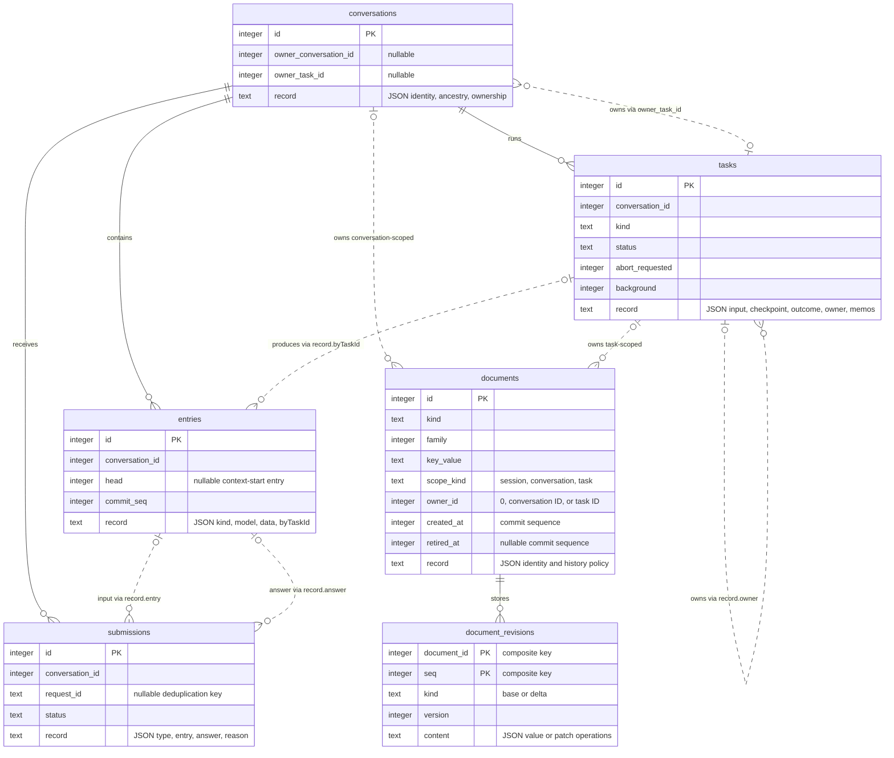
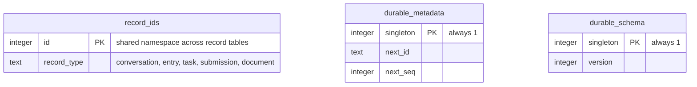

# Database data model

Both `chats/<cwd-hash>.sqlite` and `audits/<target-hash>.sqlite` under Pronto's state directory use this schema. Each database is one Durable session.

The default state directory is `~/.local/state/pronto`. `PRONTO_STATE_DIR` overrides it; otherwise an absolute `XDG_STATE_HOME` selects `$XDG_STATE_HOME/pronto`. See [Credentials and audit storage](README.md#credentials-and-audit-storage) for path selection and locking. The adjacent `.lock` files hold ownership locks, not conversation data.

## What each table is for

The tables separate conversation history, recoverable execution and structured application state.

### Conversation history

#### `conversations`

Identifies each conversation and records any parent or owning task.

In the chat database, one conversation continues across restarts. In an audit database, each new assessment attempt gets its own conversation.

The row does not contain messages or agent configuration. Those live in entries and documents.

#### `entries`

Stores the append-only history of a conversation: user input, system instructions, model responses, tool calls and tool results.

Entries can also store bookkeeping records that are not sent to the model. An audit recheck is an entry with kind `app.review-audit-recheck`. It records that evidence was checked again without adding another user message.

### Recoverable execution

#### `submissions`

Tracks whether an admitted request has been answered.

A submission connects a request to its input entry and eventual answer entry. Its status distinguishes queued, placed, done and unanswered requests.

The optional `request_id` provides deduplication within a conversation. Audits use it to avoid submitting the same saved evidence twice after a restart.

A submission answers: "What is the status of this request, and where is its answer?"

#### `tasks`

Tracks the individual pieces of work needed to answer a request.

One submission can require several model generations and many tool calls. Each is a task with saved input, execution state and an eventual outcome.

While unfinished, a task stores the checkpoint needed to resume. It can also store temporary durable memos, such as a fetched GitHub file. Memos are removed once the task's outcome is decided; committed tool-result entries remain.

A task answers: "What operation was running, and where did it reach?"

A terminal task is finished, but its outcome may be completed, failed, aborted, orphaned or faulted.

### Structured state

#### `documents`

Identifies structured state belonging to the session, a conversation or a task.

The table stores the document's identity, owner and history policy, not its actual value. Document kinds include:

| Document kind | Purpose |
| --- | --- |
| `pi.agent` | Model, instructions and enabled extensions |
| `pi.provider` | Persistent provider-session identity |
| `pi.live` | Current run and partial generation or tool output |
| `pi.inbox` | Queued inputs |
| `pi.usage` | Token and cost totals |
| `app.review-audit` | Saved evidence, accepted assessment and inspected file URLs |
| `app.review-audit-identity` | Evidence-and-policy fingerprint and policy hash |
| `app.review-audit-runs` | Current audit attempt, restart intent and cache pointer |

#### `document_revisions`

Stores the values of those documents.

A revision is either a complete JSON value (`base`) or a set of changes (`delta`). Durable reconstructs the current value by applying subsequent deltas to the latest base.

For example, a recheck can save a small delta that updates only `latestSuccess.lastCheckedAt`.

These revisions are not necessarily a permanent edit history. Documents configured to retain only their latest state may discard older revisions. Rewindable documents retain history needed for reads at an earlier commit.

### Storage bookkeeping

#### `record_ids`

Reserves IDs across all record types.

Conversations, entries, tasks, submissions and documents share one ID namespace within the database. Conversation IDs are therefore not consecutive: other records receive the intervening IDs.

#### `durable_metadata`

Tracks the next record ID and next commit sequence.

A commit sequence identifies an atomic batch of saved changes. Several records written together can share that sequence. It is not a timestamp.

#### `durable_schema`

Records the SQLite schema version.

Durable uses it to determine which database migrations are needed. This is separate from the version of an individual document's JSON format.

## Core tables

Relationships are logical references enforced by Durable, not declared SQLite foreign keys. Dashed lines highlight conditional ownership or references stored inside JSON records.



## Bookkeeping tables

These 3 tables sit alongside the core tables. `record_ids` reserves IDs across conversations, entries, tasks, submissions and documents.



## How the tables work together

For a new audit:

```text
conversations       identifies the assessment attempt
documents           identifies its evidence and report state
document_revisions  stores the evidence, then the accepted report
submissions         tracks the assessment request
tasks               runs the model and tools
entries             preserves their messages and results
```

For an unchanged-evidence recheck, there is no new conversation, submission or model task. It appends a receipt to `entries` and updates the cache document through `document_revisions`. Both changes share one atomic commit.

## Reading the model

- `documents.owner_id` is polymorphic: its meaning depends on `scope_kind`. Session documents have no conversation or task owner.
- A document's value is the latest `base` plus subsequent `delta` revisions, not `documents.record`. Use Durable's snapshot API to read the reconstructed value.
- Submission-to-entry and task-to-entry links live inside JSON records.
- Audit snapshots, reports and cache state are document kinds, not extra tables.
- Rechecks are `entries` with kind `app.review-audit-recheck`. They also update `latestSuccess.lastCheckedAt` in the session-scoped `app.review-audit-runs` document.
- Commit sequences are not timestamps. Changes saved in the same atomic commit share a sequence.

The audit document definitions are in [`auditor.ts`](auditor.ts).

## Audit database contents

Each PR has one database at `<state-directory>/audits/<target-hash>.sqlite`, shared by the CLI and chat command across working directories. It can contain several audit conversations. The coding conversation remains separate in `<state-directory>/chats/<cwd-hash>.sqlite`.

Each newly admitted audit attempt creates an independent conversation. Its evidence and identity are saved together, before submitting work to the model.

The application stores these logical documents, not separate tables for each kind:

| Document kind | Scope | Contents |
| --- | --- | --- |
| `app.review-audit` | Conversation | `snapshot`: PR details, pinned commits, comments, replies, thread states, changed files and patches. `report`: accepted assessments, initially `null`. `inspected`: URLs of remote file ranges read by tools. |
| `app.review-audit-identity` | Conversation | `fingerprint`: evidence and policy hash. `policy`: model and auditor configuration hash. Older conversations may not have this document. |
| `app.review-audit-runs` | Session | `active`: latest admitted conversation ID. `complete`: whether that attempt has settled, including failure or cancellation. `restartModel`: saved force-restart intent, otherwise `null`. `latestSuccess`: eligible cached conversation ID, fingerprint, publication time (`assessedAt`) and last evidence-check time (`lastCheckedAt`), otherwise `null`. |

Each assessment in `report` has a `commentKey` and a `findings` array. Each finding contains `summary`, `status`, `reason` and `evidence` URLs. The overall verdict and counts are calculated when printing; they are not additional report fields.

Once the input is placed, the conversation transcript also contains the full snapshot as a user message. Committed model responses and tool results follow it. Remote file excerpts appear in file-tool results; this is not a local PR checkout. Accepted assessment arguments appear in the assistant's `report_review_assessment` call. That tool's result is an acknowledgement, while the accepted assessment is mirrored in `app.review-audit.report`. Rejected report proposals can also appear in the transcript.

Expect these changes across invocations:

| Event | Database effect |
| --- | --- |
| New audit after a cache miss | New conversation, evidence snapshot and identity; then submission, model and tool records, and an accepted report if successful. Older conversations remain stored. |
| Resume an unfinished audit | Same conversation and snapshot. The stable `review-audit:<snapshot.id>` request ID avoids a duplicate submission. Recovery updates task state and can add further model and tool entries. |
| Reuse an unchanged assessment | No new conversation, submission or assessment. Append an `app.review-audit-recheck` entry to the cached conversation and update `lastCheckedAt`. The receipt records the fingerprint, new check's snapshot ID and fetch window, not another full snapshot. Original evidence and report remain unchanged. |
| Force a restart | Save restart intent, cancel unfinished work if present, then create a new conversation when fresh evidence is admitted. Keep the cancelled conversation's existing evidence and transcript. |
| Failed attempt | Keep any admitted conversation and its partial history. The report may remain `null`; the previous successful cache is not replaced. |

A report can be saved before its submission finishes. Its presence alone does not establish a successful audit. Before the initial evidence is admitted, an interrupted fetch leaves no new conversation or snapshot, although a force-restart intent may already be saved.

In SQLite, `conversations` identifies attempts, `entries` holds transcript and recheck records, `submissions` holds request IDs and status, and `tasks` holds execution state. Tool memos support recovery while a task is live; they are removed when its outcome is decided. `documents` identifies application and built-in `pi.*` documents. Their JSON values are stored in `document_revisions` as bases or deltas. Use Durable's snapshot API to read a materialised value rather than treating the latest delta as the whole document.

For read-only inspection with Node's built-in SQLite, replace `<target-hash>` with the hash in the database filename:

```sh
STATE_DIR="${PRONTO_STATE_DIR:-${XDG_STATE_HOME:-$HOME/.local/state}/pronto}"
DB="$STATE_DIR/audits/<target-hash>.sqlite" node --input-type=module <<'JS'
import { DatabaseSync } from 'node:sqlite';
const db = new DatabaseSync(process.env.DB, { readOnly: true });
try {
  const queries = [
    `SELECT id FROM conversations ORDER BY id`,
    `SELECT id, conversation_id, status,
            json_extract(record, '$.requestId') AS request_id
     FROM submissions ORDER BY id`,
    `SELECT id, json_extract(record, '$.kind') AS kind, scope_kind, owner_id
     FROM documents WHERE retired_at IS NULL ORDER BY id`,
    `SELECT id, conversation_id, json_extract(record, '$.kind') AS kind
     FROM entries ORDER BY id`,
  ];
  for (const query of queries) {
    console.log(query);
    console.table(db.prepare(query).all());
  }
} finally {
  db.close();
}
JS
```

Conversation IDs are numeric database identities, not PR numbers. These application documents retain their latest value per scope; they are not a complete history of every document edit. Separate older audit conversations still retain their snapshots and reports.
